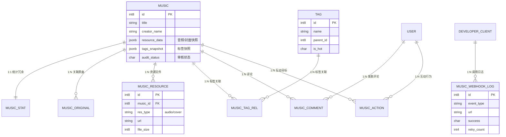

# 哈基哈米数据库设计 (音乐模块)

更新时间：2026-05-27

本文档基于 `hjm-cloud/script/sql/postgres/postgres_music.sql` 梳理音乐模块的核心表结构及关联关系。

## 1. 核心实体关系图 (ERD)

## 2. 重点表说明

### 2.1 music (音乐主表)
核心业务表，采用 JSONB 存储 `resource_data` 和 `tags_snapshot` 以减少列表查询时的 Join 操作。

### 2.2 music_stat (统计表)
分离高频读写的统计字段（播放、点赞、综合分），支持缓存预写后定时刷盘。

### 2.3 music_resource (资源表)
管理音频（128k/320k/flac）和封面（不同尺寸）的多版本 URL，支持失效检测。

### 2.4 music_webhook_log (Webhook日志)
记录开发者 Webhook 的异步分发记录、状态码及重试次数。

## 3. 索引优化策略
- **全文检索**：针对 `music.title` 和 `music.creator_name` 建立 B-tree 索引（后端支持模糊匹配）。
- **复合索引**：针对 `(audit_status, publish_time DESC)` 优化前台公开列表的分页查询。
- **关联索引**：所有外键字段 (`music_id`, `user_id`, `tag_id`) 均建立索引以提升 Join 性能。
